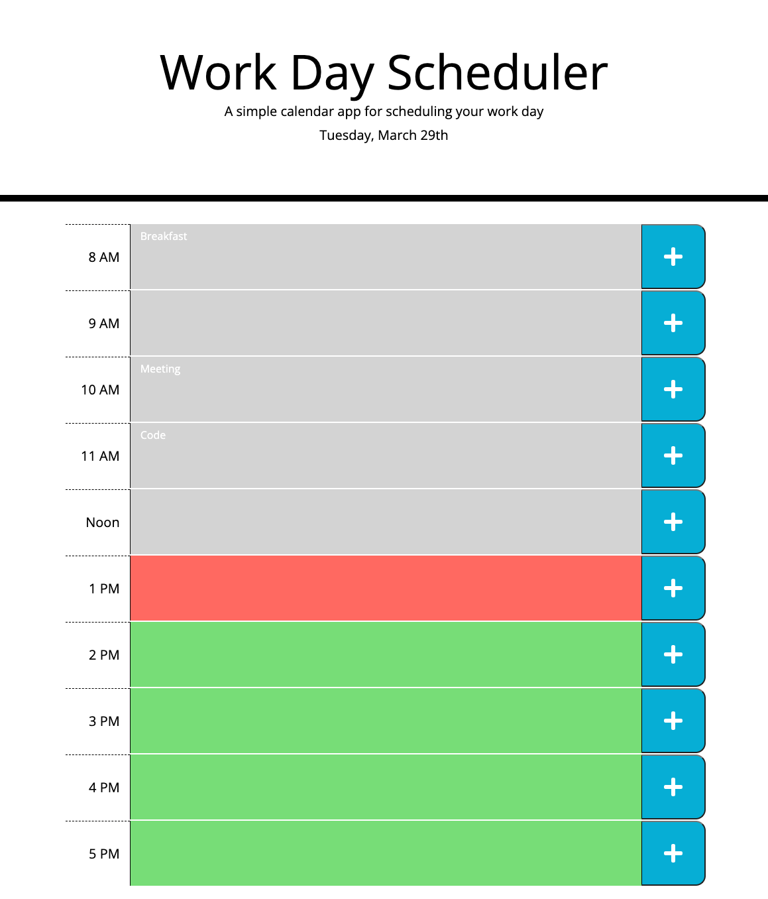

# Work Day Scheduler

## User Story
AS AN employee with a busy schedule
I WANT to add important events to a daily planner
SO THAT I can manage my time effectively

 

## Acceptance Criteria
- GIVEN I am using a daily planner to create a schedule
- WHEN I open the planner
    - THEN the current day is displayed at the top of the calendar
- WHEN I scroll down
    - THEN I am presented with time blocks for standard business hours
- WHEN I view the time blocks for that day
    - THEN each time block is color-coded to indicate whether it is in the past, present, or future
- WHEN I click into a time block
    - THEN I can enter an event
- WHEN I click the save button for that time block
    - THEN the text for that event is saved in local storage
- WHEN I refresh the page
    - THEN the saved events persist

 

___

 

## Challenges Faced
- Figuring out how to connect the submit button to the text inside the div next to the button was confusing at first, until I was able to understand the parent, siblings, and children methods.
- Making sure I looped through all of the local storage and make sure each key was appened back to the right place.
- Also, I had to make sure that everything in the script.js was in it's proper order so everything functioned correctly.

 

## *Links to GitHub repository, the active website, and a screenshot of the website:*

 

- **[Link to the GitHub Repository](https://github.com/Doctor-Worm/Super-Disco)**

- **[Friendly Parakeet Active Website](https://doctor-worm.github.io/Super-Disco/)**

 

